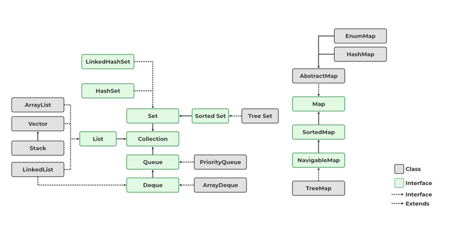

# Collection Framework

Esse repositório contém alguns exemplos de código que foram feitos durante os estudos sobre a Collection Framework do Java na plataforma de cursos da [Alura](https://www.alura.com.br/) e leituras na [GeeksForGeeks](https://www.geeksforgeeks.org/java-collection-tutorial/?ref=lbp).

## O que é o Collection Framework?

O collection framework do java é um conjunto de interfaces e classes que fornecem uma arquitetura unificada para representar e manipular coleções de objetos, como listas, conjuntos, mapas, pilhas, etc. As coleções permitem que você armazene, recupere, ordene, filtre e manipule dados de forma eficiente e conveniente. 
O collection framework do java está localizado no pacote java.util e contém os seguintes elementos:
- **Interfaces**: são tipos abstratos que definem os comportamentos e as operações das coleções. As principais interfaces são Collection, List, Set, Map, Queue, Deque, etc.
- **Implementações**: são classes concretas que implementam as interfaces das coleções. As principais implementações são ArrayList, LinkedList, HashSet, TreeSet, HashMap, TreeMap, PriorityQueue, ArrayDeque, etc.
- **Algoritmos**: são métodos estáticos que realizam operações úteis sobre as coleções, como busca, ordenação, embaralhamento, cópia, etc. A classe Collections fornece vários algoritmos para as coleções que implementam a interface Collection, e a classe Arrays fornece algoritmos para os arrays.
O collection framework do java permite que você use as coleções de forma padronizada, reutilizável e interoperável, sem ter que implementar suas próprias estruturas de dados

   

